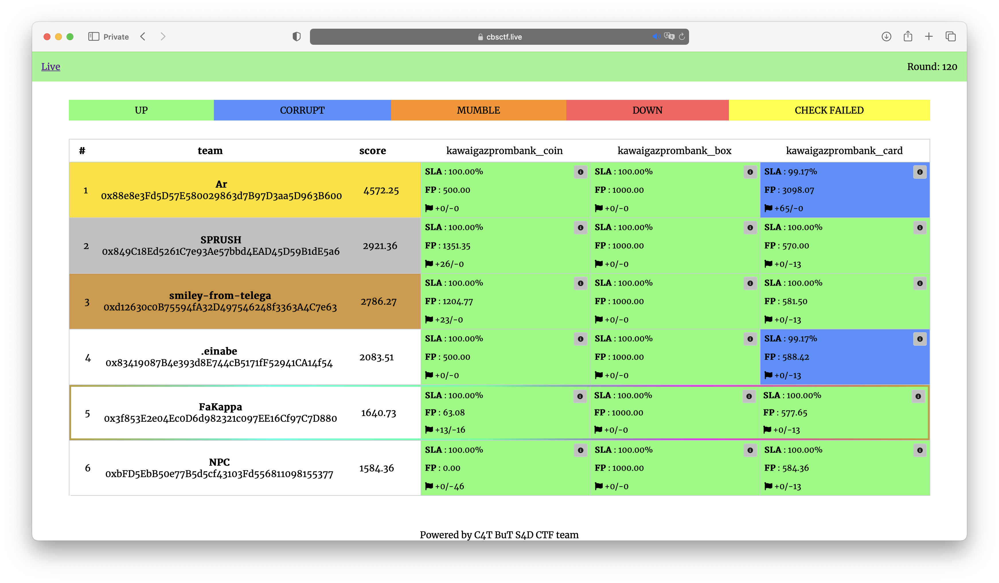

# ctfcup-2022 | Stage3 Part1

The contest was held on December 11, 2022.

Repository contains source code of services, checkers and sploits.

## Results

[Full scoreboard](scoreboard/full.png)

## Services

Services were sponsored by GazpromBank.

| Service | Language | Checker | Sploits | Authors |
|---------|----------|---------|---------|---------|
| **[KawaiGazpromBank](services/kawaigazprombank/)** | Solidity | [Checker](checkers/) | [Sploits](sploits/kawaigazprombank/) | [@b1r1b1r1](https://github.com/b1r1b1r1) |

## Infrastructure

- DevOps: [@pomo_mondreganto](https://github.com/pomo-mondreganto)
- Checksystem: [ForcAD](https://github.com/pomo-mondreganto/ForcAD)
